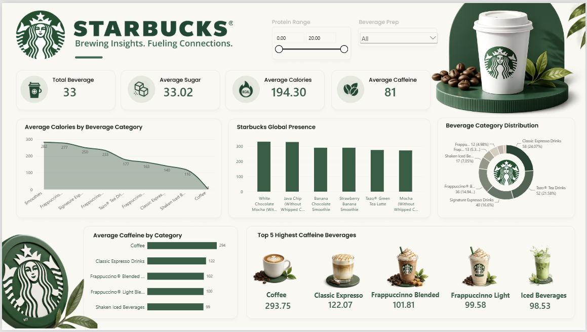

# ☕ Starbucks Insights Dashboard — Power BI

An interactive Power BI dashboard analyzing Starbucks beverage nutrition and global store presence, built with the **Starbucks Nutritional Facts** and **Store Directory** datasets.



## 📊 Overview

This dashboard surfaces beverage-level nutrition insights — calories, sugar, caffeine — and lets users filter by protein content and preparation method. It highlights:

- **KPI summary** — total beverages, average sugar, average calories, average caffeine
- **Average Calories by Beverage Category** — trend across categories
- **Starbucks Global Presence** — top beverages by average calories
- **Beverage Category Distribution** — donut breakdown by category share
- **Average Caffeine by Category** — top 5 highest-caffeine categories
- **Top 5 Highest Caffeine Beverages** — visual cards with images

## 🗂️ Repository Structure

```
starbucks-dashboard/
├── data/
│   ├── starbucks.csv       # Beverage nutrition data (calories, sugar, caffeine, etc.)
│   └── directory.csv       # Global Starbucks store directory
├── screenshots/
│   └── dashboard-final.png # Final dashboard preview
├── Starbucks_Dashboard.pbix # Power BI report file (add this yourself — see below)
└── README.md
```

## 🛠️ Tools Used

- Power BI Desktop
- Data: Starbucks Nutrition Facts dataset, Starbucks Store Directory dataset

## 🚀 How to Use

1. Clone this repo
2. Open `Starbucks_Dashboard.pbix` in Power BI Desktop
3. If prompted, repoint the data source to the `data/` folder CSVs
4. Explore using the **Protein Range** slider and **Beverage Prep** dropdown filters

## 📈 Key Metrics

| Metric | Value |
|---|---|
| Total Beverages | 33 |
| Average Sugar | 33.02g |
| Average Calories | 194.30 kcal |
| Average Caffeine | 81 mg |
| Highest Caffeine Category | Coffee (293.75 mg) |

## 📄 License

Dataset sourced for educational/portfolio purposes. Starbucks name and logo are trademarks of Starbucks Corporation, used here for non-commercial dashboard demo purposes only.
